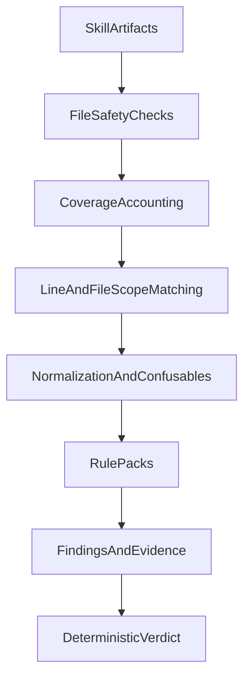

# PLAN-005 Complete Detection Hardening

## Overview

Quality-first hardening roadmap to close confirmed scanner blind spots and achieve platform-equal detection assurance across macOS/Windows/Linux.

## Objectives

- Eliminate high-confidence bypass classes before broadening detection surface.
- Preserve deterministic behavior and bounded runtime as coverage grows.
- Certify parity of detection assurance across Linux, Windows, and macOS.

## Workstream P0: Architectural Security Fixes (Blockers)

### 1) Add multi-line matching capability

- Files: `src/skill_scan/rules/engine.py`, `src/skill_scan/models.py`, `src/skill_scan/rules/loader.py`, `src/skill_scan/scanner.py`
- Introduce file-scope matching API (alongside line-scope) and map match offsets back to line numbers.
- Add `match_scope` metadata (`line` or `file`) with backward-compatible default behavior.

### 2) Decouple file-safety findings from content scanning

- Files: `src/skill_scan/scanner.py`, `src/skill_scan/config.py`, `src/skill_scan/file_checks.py`, `src/skill_scan/verdict.py`
- Emit FS findings and still content-scan when readable text exists.
- Unknown extension should no longer imply hard skip of behavioral scanning.
- Replace oversized hard-skip with bounded partial scanning plus explicit coverage metadata.
- Replace silent `OSError` drops with explicit findings.

### 3) Raise semantics for unscanned risk

- Files: `src/skill_scan/verdict.py`, `src/skill_scan/models.py`, `src/skill_scan/formatters.py`
- Add scan coverage fields (files/bytes scanned, degraded reasons).
- Apply verdict policy that upgrades severe scan degradation to at least FLAG.

### 4) Harden exclude-pattern behavior

- Files: `src/skill_scan/rules/engine.py`, `src/skill_scan/models.py`, `src/skill_scan/rules/loader.py`, `src/skill_scan/rules/data/*`
- Evaluate primary matches before exclusion logic.
- Add stricter exclusion mode metadata to prevent same-line piggyback suppression.

## Workstream P1: Coverage Expansion

### 5) Expand execution detection families

- Files: `src/skill_scan/rules/data/malicious_code.toml` (+ focused new files as needed)
- Add patterns for dynamic indirection (`__import__`, `getattr`, `importlib`, `compile+exec`), unsafe deserialization (`pickle`, unsafe `yaml.load`, `marshal`), and broader PowerShell cradle patterns.

### 6) Expand exfiltration detection families

- Files: `src/skill_scan/rules/data/data_exfiltration.toml`
- Add coverage for Python HTTP clients (`requests`, `httpx`, `urllib`), raw socket and DNS-like channels, and mail/websocket callback paths.

### 7) Add JS/TS and tool-instruction abuse coverage

- Files: new rule TOMLs in `src/skill_scan/rules/data/`
- Add JS/TS execution and command-launch signatures.
- Add tool/MCP abuse instruction signatures (dangerous paths, destructive chaining).

### 8) Improve obfuscation and Unicode robustness

- Files: `src/skill_scan/rules/data/prompt_injection.toml`, `src/skill_scan/scanner.py` (or dedicated normalization module)
- Add normalized matching pass (zero-width stripping, whitespace canonicalization).
- Expand confusable-script coverage.
- Add shorter encoded payload heuristics with FP controls.

## Workstream P2: Verification, Performance, and Release Quality

### 9) Build bypass regression corpus

- Files: `tests/unit`, `tests/integration`, fixtures
- Add positive/negative/evasion cases for multiline, obfuscation, exclusions, coverage degradation, and rule-family expansions.

### 10) Add coverage assertions and observability tests

- Validate explicit findings and verdict impact for unknown extensions, oversized files, decode failures, and read errors.

### 11) Performance and ReDoS safety gate

- Add stress tests for long lines/files and pathological regex patterns.
- Ensure bounded runtime with multiline and normalization logic enabled.

### 12) End-to-end release gate

- Require full quality and security suite pass.
- Document rule semantics, scan coverage reporting, and false-positive tradeoffs.

## Workstream P3: Platform-Equal Assurance (macOS, Windows, Linux)

### 13) OS matrix CI for assurance parity

- Files: `.github/workflows/ci.yml`
- Run quality, security, and test jobs on `ubuntu-latest`, `windows-latest`, and `macos-latest`.

### 14) Golden corpus cross-OS parity checks

- Files: `tests/*`, `.github/workflows/ci.yml`
- Create deterministic finding fingerprints and compare across OS runs.
- Enforce explicit acceptable diff policy (format/location-only deltas).

### 15) Encoding and newline parity certification

- Files: `tests/*` fixtures, `src/skill_scan/scanner.py`
- Add UTF-8/UTF-16/cp1252-like fixture matrix.
- Add LF/CRLF/CR parity tests.
- Fail CI on platform-induced detection drift beyond policy.

## Workstream P4: Cleanup (Security, Test DRY, Production Rules)

### 16) Fix security review findings

- **H-1**: Pin `astral-sh/setup-uv@v7` to SHA `a2a8b00df0aa22a77a33ee5f956c2128661fabeb` in `.github/workflows/ci.yml` (3 occurrences, lines 18/76/141).
- **M-1**: Exclude oversized files (FS-005) from content scanning in `scanner.py:115` — add `"FS-005"` to the exclusion set. Currently oversized files are flagged but still fully read and scanned (DoS vector).
- **M-2**: Narrow `except Exception` in `_fetchers.py:69` to use `try/finally` pattern for cleanup instead of broad catch.
- **M-3**: Sanitize OSError message in `scanner.py:228` — show only relative path and generic error type, not raw OS error string that may leak host environment details.
- **M-4**: Add download size limit in `_github_api.py:download_file()` — check `Content-Length` header before downloading, or stream with a size cutoff.
- **L-2**: Replace unbounded `.*` with bounded alternatives (e.g., `[^)]*` or `.{0,500}`) in regex patterns where semantics allow. Candidates in `malicious_code.toml:37` and `data_exfiltration.toml:103`.
- **L-3**: Expand `_ShiftedMatch` in `engine.py:200-215` to cover `start()`, `end()`, `groups()` methods, or define a Protocol type instead of duck-typing with `type: ignore`.
- **I-2**: Pin Semgrep version in CI (`uv pip install semgrep==X.Y.Z`).

### 17) DRY test infrastructure — extract shared `make_rule` helper

- Files: `tests/unit/rule_helpers.py` (new), 6 test files with duplicated helpers
- Extract a shared `make_test_rule()` to `tests/unit/rule_helpers.py` with a superset of all parameters (rule_id, severity, category, description, recommendation, patterns, exclude_patterns, flags, match_scope, exclude_mode).
- Replace local `make_rule`/`_make_rule` in: `test_rules_engine.py:16`, `test_engine_strict.py:16`, `test_normalizer_integration.py:11`, `test_newline_parity.py:19`, `test_bypass_exclusions.py:17`, `test_bypass_obfuscation.py:18`.
- Also deduplicate `make_finding`: import from `formatter_helpers.py` in `test_verdict.py:14` instead of redefining.
- Frees ~15-20 lines per file — critical for at-capacity test files.

### 18) Test patterns audit

- Audit all test files against `.agent/standards/TEST-PATTERNS.md` and `.agent/standards/test-rules.json`.
- Verify: TEST-007 naming convention, TEST-010 every test asserts, PARAM-001 parametrize usage, TEST-006 specific exception types.
- Review whether `tests/constants.py` needs expansion beyond HTTP status codes.

### 19) Add production rules for match_scope=file and exclude_mode=strict

- The infrastructure for file-scope matching and strict exclusion mode was built in P0 but NO production rules use either feature. The verifier flagged AC-1 and AC-3 as PARTIAL because of this.
- Add at least one file-scope rule (`match_scope = "file"`) — good candidate: multi-line `exec(base64.b64decode(...))` pattern spanning lines (EXEC-003 variant), or multi-line prompt injection where instruction override spans a line break.
- Add at least one strict-mode rule (`exclude_mode = "strict"`) — good candidate: EXEC-002 (eval/exec) where `safe_eval` should suppress only when overlapping the match, not when mentioned elsewhere on the line.
- Add positive/negative/evasion tests for new production rules.

### 20) Rename `normalize_line` to `normalize_text`

- File: `src/skill_scan/normalizer.py:71`
- The function is applied to both single lines and full multi-line content (in `engine.py:154`). The name `normalize_line` is misleading when applied to an entire file.
- Update 3 call sites in `engine.py` and test imports.

## Acceptance Criteria

- Multi-line bypass classes are detected where rule intent exists.
- No silent file drops: all degraded scan paths generate explicit findings.
- Exclude piggyback suppression is blocked by engine semantics.
- Expanded execution/exfiltration/tool-use rule families have positive + negative + evasion tests.
- Scan coverage metrics are surfaced and can impact verdict policy.
- CI passes on Linux, Windows, and macOS.
- Golden corpus parity checks pass under defined diff policy.
- Encoding and line-ending parity tests pass.
- Full `make check` and full pre-commit pass before completion.
- All CI GitHub Actions pinned to commit SHAs (no mutable tags).
- No OSError message leakage in scan findings.
- Oversized files excluded from content scanning (not just flagged).
- `make_rule` test helper extracted to single shared location (no duplication).
- At least one production rule uses `match_scope = "file"`.
- At least one production rule uses `exclude_mode = "strict"`.

## Execution Flow

